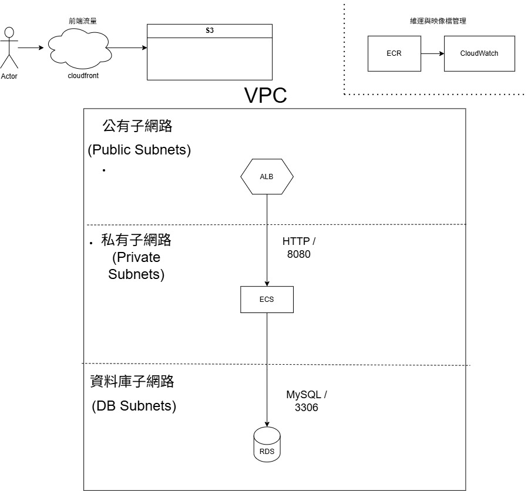

# 🛒 E-Commerce Cloud Full-Stack Application (雲端全端電商平台)

[](https://spring.io/projects/spring-boot)
[](https://react.dev/)
[](https://aws.amazon.com/ecs/)
[](https://www.terraform.io/)
[](https://github.com/features/actions)


---
一個結合現代化前端、強固後端以及完整 DevOps 雲端自動化架構的企業級全端電商平台專案。本專案採前後端分離設計，後端部署於 AWS ECS Fargate 容器服務，前端託管於 AWS S3，並全面實踐 IaC (Infrastructure as Code) 與自動化 CI/CD 交付流程。
---
<p align="center">
  
</p>

---

## 🛠️ 技術堆疊 (Tech Stack)

### Frontend (前端)
* **Core:** React, Vite, JavaScript (ES6+)
* **UI & Styling:** Bootstrap, Responsive Web Design (RWD)
* **Network & State:** Axios (RESTful API 串接), React Router DOM

### Backend (後端)
* **Core Framework:** Spring Boot (Java 17, Maven)
* **Security & Auth:** Spring Security 6, JWT (JSON Web Token), BCrypt Password Encoder
* **Data Persistence:** Spring Data JPA, MySQL
* **Architecture Patterns:** Global Exception Handler (`@RestControllerAdvice`), Transaction Management (`@Transactional`)

### Cloud & DevOps (雲端與維運)
* **Containerization & Compute:** Docker, AWS ECS (Fargate), Amazon ECR
* **Database & Storage:** AWS RDS (MySQL), AWS S3 (靜態資源託管)
* **Networking & Security:** AWS VPC, Security Groups, CloudWatch (集中式日誌監控)
* **Infrastructure as Code (IaC):** Terraform
* **CI/CD Automation:** GitHub Actions (Monorepo 路徑過濾部署)

---

## 🏗️ 系統架構與核心亮點 (Key Features & Architecture)

### 1. 雲端架構與自動化維運 (Cloud & DevOps)
* **基礎設施即程式碼 (IaC)：** 透過 Terraform 宣告式定義 AWS 雲端資源，自動化佈建 ECS Fargate 無伺服器容器叢集、ECR 映像檔倉庫、RDS 關聯式資料庫與 S3 物件儲存。
* **自動化 CI/CD 管線：** 基於 GitHub Actions 實作 Monorepo 架構，透過路徑過濾 (`paths`) 實現前後端獨立觸發部署：
  * **後端管線：** 自動完成 Maven 建置、打包 Docker 映像檔、推送到 ECR，並驅動 ECS 執行無縫容器更新。
  * **前端管線：** 自動執行靜態資源編譯與打包，並同步部署至 AWS S3。
* **日誌監控：** 整合 AWS CloudWatch 集中式日誌群組，確保容器運行狀態可視化與高效錯誤排查。

### 2. 高安全性無狀態授權機制 (Security)
* **無狀態認證：** 採用 Spring Security 6 與 JWT 實作無狀態身份驗證，透過自定義過濾器攔截請求、安全解析憑證與提取使用者角色。
* **精細化權限控制 (RBAC)：** 規範化處理權限前綴（`ROLE_`），落實 `ROLE_ADMIN`（管理員專區）與 `ROLE_USER`（一般會員與購物車）的細粒度存取控制與前端路由防護。

### 3. 高一致性商業邏輯與例外處理 (Backend Architecture)
* **關聯式資料庫設計：** 運用 Spring Data JPA 建立 `User` ⇄ `Cart` ⇄ `CartItem` ⇄ `Product` 關聯對應，支援購物車商品的即時加入、動態數量累加、刪除與總金額計算。
* **交易管理與例外防禦：** 核心購物車商業邏輯全面採用 `@Transactional` 交易管理確保資料一致性，並透過 `@RestControllerAdvice` 建立全域例外處理器，標準化統一的 JSON 錯誤響應格式。

---

## 📂 專案目錄結構 (Project Structure)

```text
.
├── .github/workflows/         # GitHub Actions CI/CD 自動化腳本
│   ├── deploy-backend.yml     # 後端自動化建置與 ECS 部署
│   └── deploy-frontend.yml    # 前端自動化打包與 S3 同步
├── terraform-infra/           # IaC 雲端基礎設施（模組化架構）
│   ├── alb_ecs.tf             # 應用負載平衡器與 ECS Fargate 服務
│   ├── cloudwatch.tf          # 雲端日誌與監控
│   ├── ecr.tf                 # Docker 映像檔倉庫
│   ├── network.tf             # VPC、子網路與網路路由
│   ├── provider.tf            # AWS Provider 設定
│   ├── rds.tf                 # RDS 關聯式資料庫設定
│   ├── s3_cloudfront.tf       # S3 物件儲存與 CDN 分發
│   ├── security_groups.tf     # 安全群組與防火牆規則
│   └── variables.tf           # 參數變數定義
├── backend/                   # Spring Boot 後端專案
│   ├── src/main/java/com/example/demo/
│   │   ├── config/            # Security 6 與 JWT 驗證設定
│   │   ├── exception/         # @RestControllerAdvice 全域例外處理
│   │   ├── service/           # 購物車與核心商業邏輯層
│   │   └── ...                # Controller, Entity, Repository 等
│   └── Dockerfile             # 後端容器化設定
└── frontend/                  # React + Vite 前端專案
    ├── src/                   # 原始碼目錄
    │   ├── components/        # Navbar 與共用組件
    │   ├── pages/             # 頁面路由 (商品列表、購物車、後台管理)
    │   └── ...                # App.jsx, main.jsx 等
    └── package.json           # 依賴管理與腳本配置
```

## 🚀 快速開始與執行指南 (Getting Started)

### 前置準備 (Prerequisites)
在開始之前，請確保您的環境已安裝：
* Java 17+
* Maven 3.x
* Node.js 18+
* MySQL 8.0+ (請先在 MySQL 中建立好對應的資料庫)

---
1. **配置資料庫連線：** 
 若使用 Docker 運行後端，請確保 `backend/src/main/resources/application.properties` 中的 DB URL 指向您的主機（而非容器內部）：
 ```properties
 # 如果是 Windows/Mac，請使用 host.docker.internal
 spring.datasource.url=jdbc:mysql://host.docker.internal:3306/your_database?useSSL=false&serverTimezone=UTC
 ```
進入後端資料夾並建立 Docker 映像檔：

```bash
cd backend
docker build -t spring-boot-app .
docker run -d -p 8080:8080 --name my-backend spring-boot-app
```
### 方法二：傳統本地端開發模式

設定資料庫：於 backend/src/main/resources/application.properties 配置 MySQL 連線：

```Properties
spring.datasource.url=jdbc:mysql://localhost:3306/your_database?useSSL=false&serverTimezone=UTC
spring.datasource.username=your_username
spring.datasource.password=your_password
```
啟動後端 (Spring Boot)：

```Bash
cd backend
mvn clean install
mvn spring-boot:run
```
啟動前端 (React + Vite)：
```Bash
cd frontend
npm install
npm run dev
```


